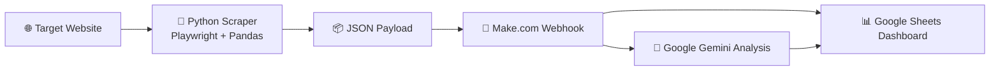

# Competitor Intelligence Engine

> 🚀 An AI-powered market research automation that scrapes competitor data, cleans it for analysis, routes it through an orchestration layer, and turns raw signals into dashboard-ready intelligence.

## 🎯 Overview

The **Competitor Intelligence Engine** is a lightweight, extensible automation pipeline for continuous market research. It combines browser automation, data cleaning, workflow orchestration, and AI analysis to help teams monitor competitor activity without relying on manual spreadsheet work.

At its core, the project captures structured product data from the web, standardizes it with Python, pushes it into a Make.com workflow, and prepares the dataset for downstream enrichment, trend analysis, and reporting in a Google Sheets dashboard.

## 🧰 Tech Stack

| Layer | Technology | Purpose |
| --- | --- | --- |
| Scraping Engine | **Python** | Core application runtime |
| Browser Automation | **Playwright** | Dynamic page navigation and extraction |
| Data Processing | **Pandas** | Cleaning, normalization, and shaping of records |
| Workflow Orchestration | **Make.com** | Webhook ingestion, routing, automation logic |
| AI Analysis | **Google Gemini** | Trend synthesis, summary generation, insight extraction |
| Reporting Layer | **Google Sheets** | Lightweight dashboard for stakeholder visibility |

## 🏗️ Architecture Overview

The current implementation uses a Python scraper to collect competitor product data and serialize it into JSON. That payload is then posted to a **Make.com webhook**, where the workflow can validate records, trigger **Google Gemini** for AI-assisted analysis, and write both raw and enriched outputs into a **Google Sheets dashboard** for ongoing monitoring.



### Data Flow

1. **Scrape**: Playwright loads the target site and extracts structured competitor data.
2. **Clean**: Pandas standardizes fields such as price, availability, and URLs.
3. **Transmit**: The script posts the cleaned payload to a Make.com webhook.
4. **Orchestrate**: Make.com routes the payload through business logic and downstream services.
5. **Analyze**: Google Gemini can generate trend summaries, opportunity signals, or narrative insights.
6. **Report**: Final outputs land in Google Sheets for a simple, client-friendly dashboard layer.

## ✨ Features

- **Production-Grade Logging**: Structured console and file-based logging for observability, retries, and failure tracing.
- **AI Trend Synthesis**: Designed to feed structured competitor data into Google Gemini for insight generation and strategic summaries.
- **Automated Scheduling**: Suitable for recurring execution through Make.com schedules, CI pipelines, cron, or task schedulers.
- **Webhook-Based Integration**: Clean handoff from local scraping logic into broader automation workflows.
- **Portable JSON Output**: Generates machine-readable payloads that are easy to reuse across dashboards and downstream systems.

## ⚙️ Setup Instructions

### 1. Clone the project

```bash
git clone <your-repository-url>
cd competitor-intel-engine
```

### 2. Create a virtual environment

```bash
python -m venv .venv
```

Activate it:

```bash
# Windows
.venv\Scripts\activate

# macOS / Linux
source .venv/bin/activate
```

### 3. Install dependencies

```bash
pip install -r requirements.txt
playwright install chromium
```

### 4. Configure environment variables

For a production-ready setup, keep secrets and endpoints out of source code and provide them through environment variables instead.

Recommended variables:

```bash
WEBHOOK_URL=https://your-make-webhook-url
```

Example on Windows PowerShell:

```powershell
$env:WEBHOOK_URL="https://your-make-webhook-url"
```

Example on macOS / Linux:

```bash
export WEBHOOK_URL="https://your-make-webhook-url"
```

### 5. Run the scraper

```bash
python scraper.py
```

## 📁 Output

The script currently produces:

- `competitor_data.json` for structured scraped output
- `scraper.log` for execution and error logs

## 🔐 Configuration Notes

The current script includes the webhook configuration directly in [scraper.py](</C:/Users/ahmad/Documents/competitor-intel-engine/scraper.py:25>). For client delivery or production deployment, the recommended next step is to load `WEBHOOK_URL` from environment variables instead of storing it in the repository.

## 💼 Ideal Use Cases

- Competitor price monitoring
- Product availability tracking
- Lightweight market intelligence dashboards
- AI-assisted research briefs for founders, operators, and analysts

## 👤 Contact

**Name:** Ahmed [Your Last Name]  
**Portfolio:** [https://your-portfolio-link.com](https://your-portfolio-link.com)  
**Email:** your-email@example.com

## 📌 Positioning

This project demonstrates how to combine **web scraping**, **workflow automation**, and **LLM-powered analysis** into a practical market research system that is easy to explain to clients, employers, and non-technical stakeholders.
